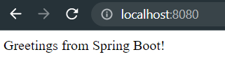
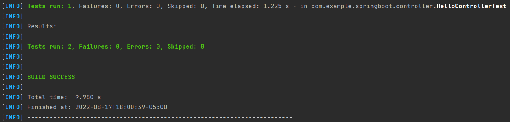
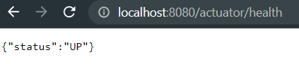
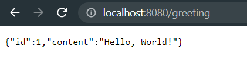
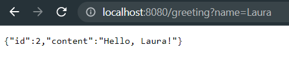

# Taller 01 - Introducción a Spring Boot

El siguiente repositorio fue desarrollado siguiendo las guias [Building an Application with Spring Boot](https://spring.io/guides/gs/spring-boot/) y [Building a RESTful Web Service](https://spring.io/guides/gs/rest-service/) ofrecidas por [Spring](https://spring.io/)

## Requerimientos

* **Git**, Sistema de control de versiones
* **Maven**, Software para la gestión y construcción de proyectos Java
* **Java**, Entorno de desarrollo software


## Configuración y ejecución  
Descargar o clonar el proyecto, ir a la carpeta spring-boot_ directory y ejecutar
```
mvn spring-boot:run
```

## Probar la aplicación 
Ir al navegador y probar `localhost:8080`. El resultado debería ser 



También se puede probar el servicio desde la terminal. Prueba `curl localhost:8080` y el resultado debería ser el mismo. 

Para ejecutar las pruebas correspondientes utiliza `mvn test`, el resultado debería ser


You can check the health of the application by running the following command `curl localhost:8080/actuator/health`. The result should be 



### Agregando un nuevo controlador 
 Para el servicio RESTful, se crea un nuevo controlador, el cual se encargará de las peticiones realizadas al path _/greeting_. Este responderá en formato JSON la representación de un saludo 

El valor por defecto será, _World_, para probarlo en el navegador utiliza `localhost:8080/greeting`, el resultado debería ser 



De igual forma, si se quiere probar desde la terminal, utiliza `curl localhost:8080/greeting`, el resultado debería ser el mismo

Si se agrega el parámetro _name_, el saludo cambiara World por el valor pasado como parámetro. Para probarlo en el navegador utiliza `localhost:8080/greeting?name=Laura`, el resultado debería ser 



De igual forma, si se quiere probar desde la terminal, utiliza `curl localhost:8080/greeting?name=Laura`, el resultado debería ser el mismo
